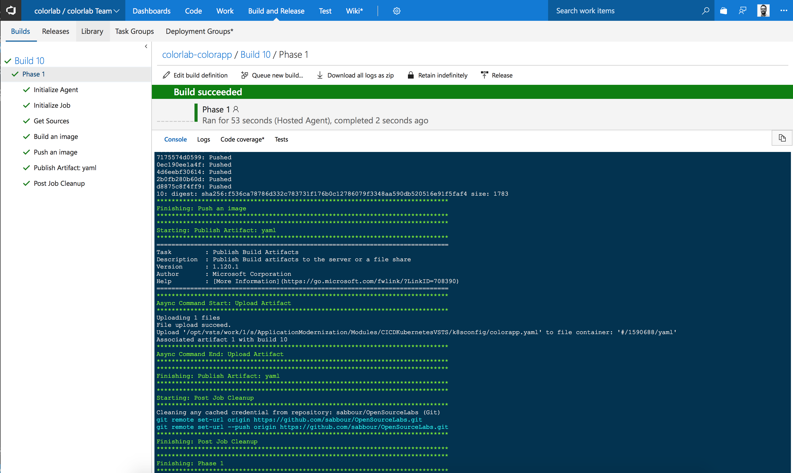

# Continuous Delivery with containers to Kubernetes using Visual Studio Team Services


## Table of Contents


## Overview and Pre-Requisites

### Overview

In this lab, you're going to take a Node.js application that is composed of 2 Docker containers and publish it using CI/CD practices to Kubernetes cluster running on Azure Container Service, leveraging Visual Studio Team Services. The Docker images you create will be pushed to an instance of Azure Container Registry.

The 2 container components of this lab are:
1. colorapp
2. colormicroservice

Essentially, the **colorapp** does AJAX requests to the **colormicroservice** and plots the results. The **colormicroservice** returns the hostname of the machine in addition to a random hex color.

### Pre-requisites

- Docker installed on your machine
    
    On Windows, install Docker for Windows: https://docs.docker.com/docker-for-windows/install/#install-docker-for-windows 
    
    On a Mac, install Docker for Mac: https://docs.docker.com/docker-for-mac/install/#install-and-run-docker-for-mac 
    
    Then, verify installation:
    ```
    docker -v
    ```
- Visual Studio Code (or your favorite code editor)
    
    On Windows and Mac, download and install from: https://code.visualstudio.com/Download

- Azure CLI installed and configured with your Azure subscription
    
    On Windows, download and install from: https://aka.ms/InstallAzureCliWindows 
    On a Mac, run the below command in Terminal
    ```
    curl -L https://aka.ms/InstallAzureCli | bash
    ```

    Then login into your Azure subscription to verify installation:
    ```
    az login
    ```

    If you have many subscriptions, you may choose one:
    ```
    az account set -s <subscription-GUID>
    ```

    Create the Resource Group to use throughout the lab:
    ```
    az group create -n <rg name> -l westeurope 
    ```

    Set the default Resource Group for your session, to avoid typing it in all commands
    ```
    az configure --defaults group=<rg name>
    ```
- You should also **Fork** this repository as one of the steps would involve you modifying the source code and committing it to trigger the CI/CD pipeline.
 
### Topics Covered

- Running locally
- Pushing Docker images to Azure Container Registry
- Creating Azure Container Service with Kubernetes as the orchestrator
- Creating staging deployment slot for microservice
- Configure Build Pipeline
- Configure Release Pipeline
- Triggering a build using a code change
- Scaling the application

## Lab


### Running locally

**Fork** then clone your forked repository to your machine

Change directory to ```ApplicationModernization/Modules/CICDKubernetesVSTS```

Build both images
```
docker build -t colorapp src/colorapp/.
docker build -t colormicroservice src/colormicroservice/.
```

Run using Docker Compose
```
docker-compose up
```

Browse to http://localhost/


### Pushing Docker images to Azure Container Registry

Create an Azure Container Registry (~2 minutes)
```
az acr create -n <registry name> --admin-enabled --sku Managed_Standard
```

Login into the registry. This will enable your local Docker installation to be able to access the registry.
```
az acr login -n <registry name>
```

Change both image tags to point to the registry
```
docker tag colorapp:latest <registry name>.azurecr.io/<image>:latest
docker tag colormicroservice:latest <registry name>.azurecr.io/<image>:latest
```

Publish your images to the registry
```
docker push <registry name>.azurecr.io/colorapp:latest
docker push <registry name>.azurecr.io/colormicroservice:latest
```

### Creating Azure Container Service with Kubernetes as the orchestrator

Create the ACS cluster with Kubernetes as the orchestrator (~ 10 mins)
```
az acs create -n <acs name> -t kubernetes --generate-ssh-keys
```

Install ```kubectl```. On Windows, add ```C:\Program Files (x86)\``` to your **PATH** then restart the CMD prompt

```
az acs kubernetes install-cli
```

Get the cluster credentials
```
az acs kubernetes get-credentials -n <acs name>
```
> The Kubernetes config file should now be present in ```~/.kube/config```. You will need its content later when configuring VSTS. 

### Create Kubernetes namespaces for production and staging

Examine the ```k8sconfig/namespaces.yaml``` file. This defines the [Kubernetes namespaces](https://kubernetes.io/docs/concepts/overview/working-with-objects/namespaces/) for the production and staging environments. Once created, you should be able to target a specific environment while deploying your containers.

```YAML
apiVersion: v1
kind: Namespace
metadata:
  name: production
---
apiVersion: v1
kind: Namespace
metadata:
  name: staging
```

Execute the configuration by running
```
kubectl apply -f k8sconfig/namespaces.yaml
```

### Configure the Azure Container Registry secret in Kubernetes
Get the Azure Container Registry username and password
```
az acr credential show -n <acr name>
```

Register the Azure Container Registry secret called **acrsecret** within Kubernetes. You'll later reference this in the YAML files.
> You'll need to do this once per namespace, hence repeat the command below once with ```--namespace=production``` and ```--namespace=staging```
```
kubectl create secret docker-registry acrsecret
--docker-server=<acr name>.azurecr.io
--docker-username=<your acr admin username>
--docker-password=<your acr admin password>
--docker-email=<your email>
--namespace=<namespace>
```

Browse to the Kubernetes dashboard
```
az acs kubernetes browse -n  <acs name>
```

You should be able to view the Kubernetes dashboard, showing the namespaces you created as in the following screenshot.


Examine the ```k8sconfig/colorapp.yaml``` and ```k8sconfig/colormicroservice.yaml``` files which should be like the below. Notice the placeholders ```__ACRNAME__```, ```__BUILDVERSION__``` and ```__COLORMICROSERVICEURL__```. These will be replaced by the build process in VSTS with the variables defined inside VSTS.

> Note the ```imagePullSecrets``` property with the value **acrsecret**. This tells Kubernetes what is the name of the secret you configured to allow it to pull the image from your Azure Container Registry.


```YAML
apiVersion: apps/v1beta1
kind: Deployment
metadata:
  name: colorapp
spec:
  replicas: 2
  template:
    metadata:
      labels:
        app: colorapp
    spec:
      containers:
      - name: colorapp
        image: __ACRNAME__.azurecr.io/colorapp
        ports:
        - containerPort: 3000
        env:
        - name: COLORMICROSERVICE
          value: "__COLORMICROSERVICEURL__"
      imagePullSecrets:
        - name: acrsecret
---
apiVersion: v1
kind: Service
metadata:
  name: colorapp
spec:
  type: LoadBalancer
  ports:
    - port: 80
      targetPort: 3000
      protocol: TCP
  selector:
    app: colorapp
```

```YAML
apiVersion: apps/v1beta1
kind: Deployment
metadata:
  name: colormicroservice
spec:
  replicas: 2
  template:
    metadata:
      labels:
        app: colormicroservice
    spec:
      containers:
      - name: colormicroservice
        image: __ACRNAME__.azurecr.io/colormicroservice
        ports:
        - containerPort: 3000
      imagePullSecrets:
        - name: acrsecret
---
apiVersion: v1
kind: Service
metadata:
  name: colormicroservice
spec:
  type: LoadBalancer
  ports:
    - port: 3000
      targetPort: 3000
      protocol: TCP
  selector:
    app: colormicroservice
```


### Configure Build Pipeline for **colorapp**

You're now going to use Visual Studio Team Services to setup the Build and Release pipelines.

> Since we have 2 Docker containers, we'll opt to create multiple build and release pipelines, one per container. This will give you the flexibility to later add more microservices and control the build process for each of them individually.

Go to http://www.visualstudio.com and hit **Sign in** then sign in with your Microsoft account you use for Azure.


If you don't have an account, setup an account by hitting **Create new account** otherwise, just create a **new team project**.


Create an account if you have to. This should take a few minutes, and it will create a project for you.


Otherwise, create a new project on your existing account.

 

Once your project is ready, you will see the screen below. Since you're already hosting the source code somewhere else (you forked this repo in Github, right?), you'll choose the option to build code from an external repository.


Hit the **New Definition** button to start.

You'll now create the build definition for the **colorapp**.


Select the **empty process** template.


Change the process agent queue to **Hosted Linux Preview**. This has the tools required to build the Docker images. Rename the build process to **colorlab-colorapp**.


Now authorize Visual Studio Team Services to your Github account then pick the right repository that you forked.


After configuring the repository, hit **Add Task**. You're now going to add a Docker task to build a Docker image from your source code.


In the task, you're going to point it towards your Azure Container Registry and you're going to configure it to point to the Docker file that should be in the following path in your forked repository: ```ApplicationModernization/Modules/CICDKubernetesVSTS/src/colorapp/Dockerfile```

Additionally, make sure that the image name is ```colorapp:$(Build.BuildId)``` and that **Qualify Image Name** is checked.

This will tag the image version with your Azure Container Registry name and **Build Id** allowing you to control which version is eventually deployed. Do not use the **latest** tag here.


Now add another Docker task, this time configure it with **Push an image** action and the same image name ```colorapp:$(Build.BuildId)```. Make sure **Qualify Image Name** is checked.


Add a  **Publish Build Artifacts** task. Configure the task to publish the Kubernetes YAML file for this application located at ```ApplicationModernization/Modules/CICDKubernetesVSTS/k8sconfig/colorapp.yaml```


Head over to the **Triggers** tab, and enable Continuous Integration. This will trigger the build pipeline whenever a new change is committed to your code repository.

Naturally, you could do this on a specific branch.


Finally, hit the **Save & queue** button to queue a build manually, then review the build log, you should be able to see something like the below.



Congratulations, you've run your first build pipeline! If you login to the Azure Portal and navigate to your Azure Container Registry, you should be able to find the image there.

Your tag here may differ depending on how many times you ran this build. Every time the build runs, a new image with a new tag is created.


### Configure Build Pipeline for **colormicroservice**

> Since we have 2 Docker containers, we'll opt to create multiple build and release pipelines, one per container. This will give you the flexibility to later add more microservices and control the build process for each of them individually.

Instead of repeating the steps all over again, simply **Clone** the build pipeline you just created, then change the references to **colorapp** to be references to **colormicroservice** for the Dockerfile location, Docker image name and Kubernetes YAML file.


Once you save it, you should end up with 2 build pipelines as below.


### Configure Release Pipeline for Staging

Now that you have your build pipeline configured to trigger automatically on every code commit, it is time for you to configure the release pipeline, to actually deploy your new Docker images.

> Similarly to the Build Pipeline, you'll create 2 Release Pipelines, one per container. This will give you the flexibility to later add more microservices and control the release process for each of them individually.

Head over to the **Releases** tab and hit the **new definition** button. 


Start with an **Empty process** template.


And name this environment **Staging** then click on the **1 phase, 0 task** link to start adding tasks. Rename the definition to **colorapp**.

First thing to do would be to do add the variables in the **Variables** tab. You'll use these to replace the tokens in the YAML file.


For running kubectl commands by using the task, first you need to create a service connection to Kubernetes cluster.


 You'll thn need to providing the following details:

- **Server URL**: you can get this detail from the Azure portal overview page of the ACS cluster. 


- **Kubeconfig**: When you ran ```az acs kubernetes get-credentials```, a Kubernetes config file was created in ```~/.kube/config```. You will need copy/paste the content of the master Kubernetes cluster configuration here. You can view its content by running a ```cat ~/.kube/config``` in your terminal.


Once this is configured

You will also need to configure the **Secret name**.

Now add an **Azure App Service Deploy** task.


Configure the task by choosing your microservice Web App, checking **Deploy to slot** and choosing the **staging slot**.

You also need to provide your Azure Container Registry namespace in the form of ``<acr name>.azurecr.io``, the microservice image name in the repository as ``colormicroservice`` and the image tag as ``$(Build.BuildId)``.


When you're done, save the definition and head to the **Pipeline** tab and click on **add artifact**.


Then configure the artifact version to be specified at the time of release, and give it a name **Drop**.


Finally, hit the small lightning bolt on the artifact to configure the continuous deployment trigger then hit save.


At this point, you may check your configuration by manually triggering a release through hitting the **Release** button then select the latest version from the Drop dropdown list.


Review the logs to see the release progress.


Once the release is complete, you should be able to access the microservice in the staging environment here [http://<microservice name\>-staging.azurewebsites.net/colors]()


### Add Production environment to Release Pipeline

You'll now create a new environment, pointing to the production slot on the Web App.

Hover over the **Staging** environment and hit the **add** button to add a serial release step


Like before, select the **empty process** template.


And name this environment **Production** then click on the **1 phase, 0 task** link to start adding tasks.


Now add an **Azure App Service Manage** task.


Configure the task with the microservice Web App name and choose the slot and make sure **Swap with production** is checked then **save**.


Go back to the **Pipeline** tab and click on the **Pre-deployment conditions** to configure a gated deployment step.


Add yourself (or someone else on your project) as a pre-deployment approver. This means that you will need to approve swapping the staging environment into production.


### Adding color into this

Now as you may have noticed, when you browse to the Web App [http://<color app name\>.azurewebsites.net](http://webappname.azurewebsites.net), despite this app being called "colors" of the cluster, there aren't actually any colors!


We'll go ahead and fix that now.

Go to your fork of the Github repository, and navigate to ```ApplicationModernization/CICDAppServiceVSTS/src/colormicroservice/routes/colors.js``` then hit the edit button to edit this file.


Comment line 9 and uncomment line 10, to enable colors.


Scroll down to the bottom, and hit **Commit changes**.


This should trigger a build, then release the change to the staging environment. You will also get an email now that you need to approve swapping this deployment into production.


Once you click on the button, you will be able to Approve or Reject this. Hit Approve, and this will continue the deployment pipeline to deploy to production.


Switch to the browser running the Web App, wait for a few minutes as the swap is completed, and you should start seeing some color.


### Scaling your cluster
Now that you are running the new app, scale the App Service Plan to more instances either using the Azure Portal or by executing the command below.
```
az appservice plan update --number-of-workers 10 -n <plan name>
```

In a few moments, as the Docker images are being pulled and deployed on new VMs, you should see more instances lighting up on your screen.


## Conclusion

In this lab, you created a private Docker image repository on Azure Container Registry and pushed an application image to it. You also created an App Service Plan running Linux and a Web App with production and staging slots.

You configured a CI/CD pipeline using Visual Studio Team Services to build Docker images and push them to Azure Container Registry, then deploy them to a staging slot, followed by swapping with production.

Finally, you scaled the App Service plan to run more instances.


## End your Lab

Clean up your lab by deleting the Resource Group you created.
```
az group delete -n <rg name>
```

## Additional Resources and References

- [Azure Container Registry](https://docs.microsoft.com/en-us/azure/container-registry/)
- [Azure App Service Linux](https://docs.microsoft.com/en-us/azure/app-service/app-service-linux-readme)
- [Visual Studio Team Services](https://www.visualstudio.com/team-services/)
- [Continuous deployment with Azure Web Apps for Containers](https://docs.microsoft.com/en-us/azure/app-service/containers/app-service-linux-ci-cd)


## License

Copyright (c) Microsoft Corporation. All rights reserved.

Licensed under the [MIT](LICENSE) License.
